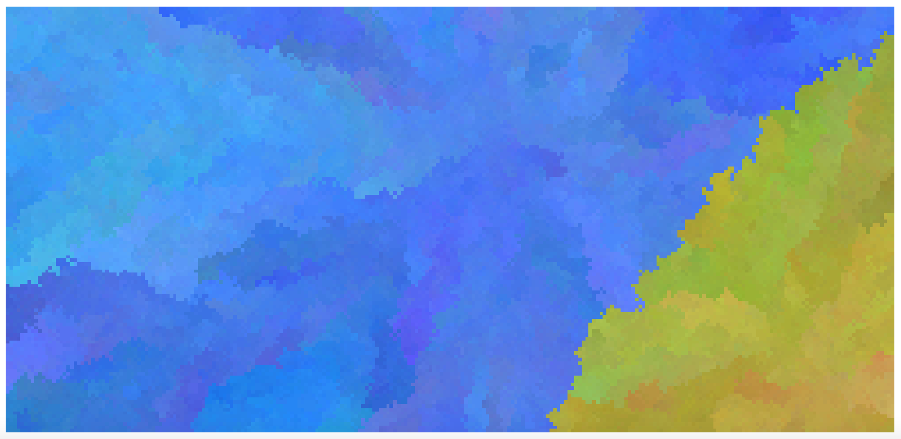
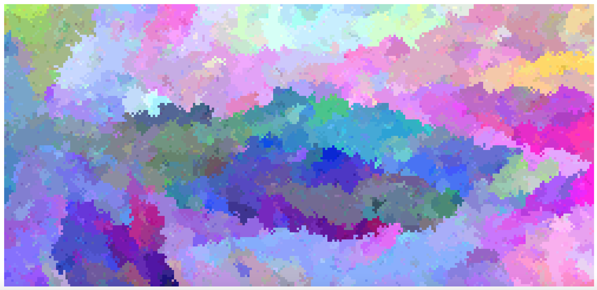
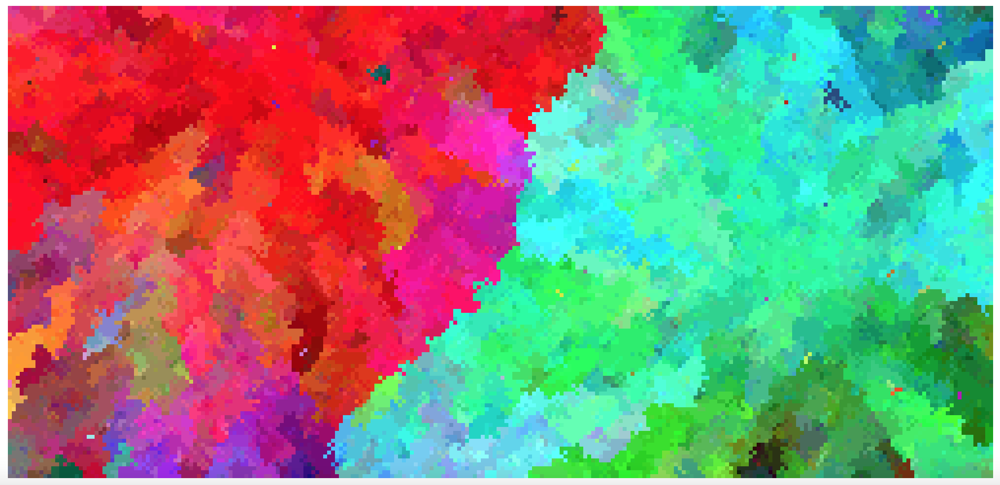
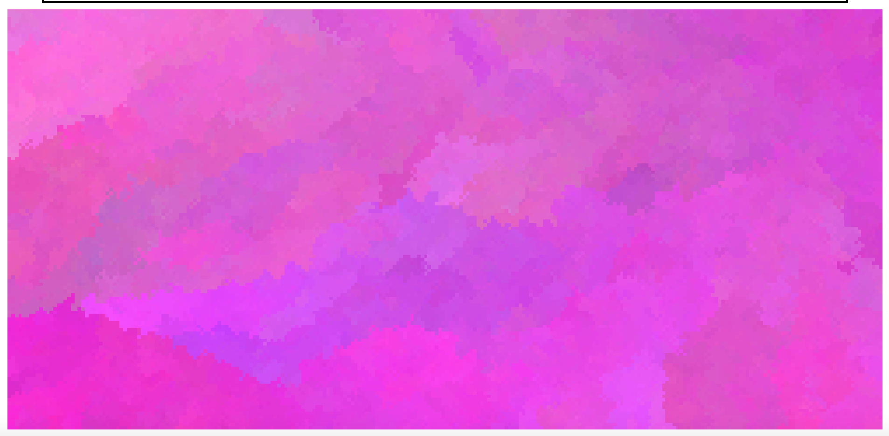
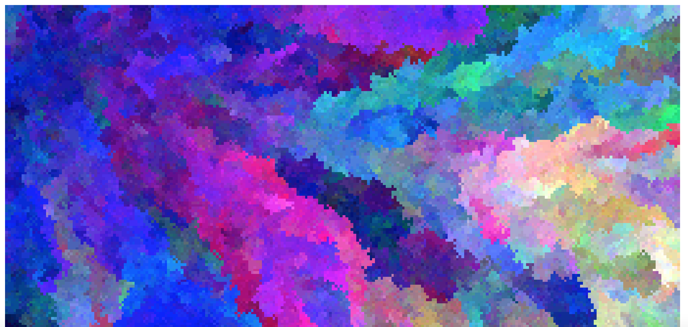
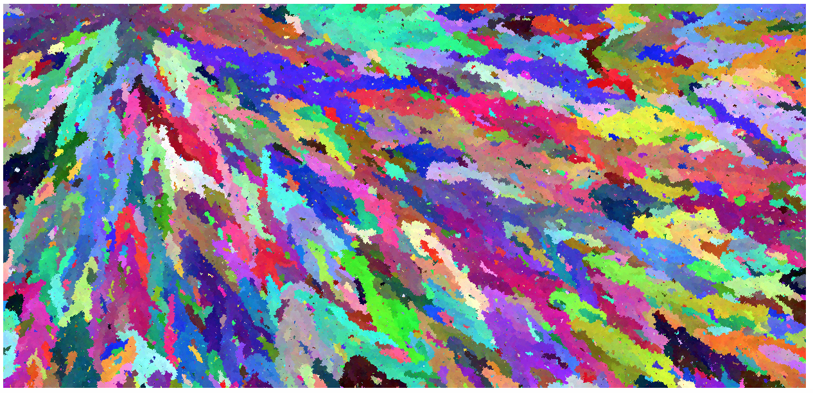
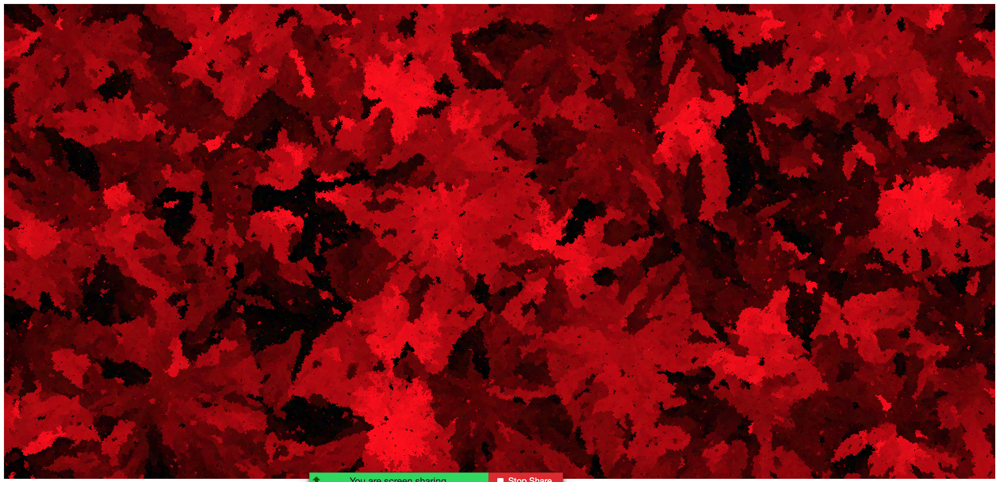

# Visual Art Generator

[Live Demo](https://react-random-art-richter.vercel.app)

### Description
Commisioned by composer Jake Richter, this project applies the concept of generating art by way of
predetermining constraints, and otherwise allowing anything to occur within those constraints.
The project uses divs to represent cells of a grid, which can also be thought of as pigments 
of color in a visual art piece. The program is given constraints via the form, and generates random
background colors for each div while staying within the given constraints. The result is an
art display that appears similar to an impressionist painting.

 
 
 